# 프롬프트 구조화 실습 기록지 (Week 5 A/B)

- 이름: 확인 필요
- 사용한 AI 도구·모델: Claude Code, Claude Sonnet 5 (A·B 모두 동일 모델, 대화는 모두 중국어로 진행)
- 선택한 개선 아이디어: 커피 배달 게임(index.html) 기능 확장
  - **A**: CLAUDE.md(system prompt) 없이, 다른 대화창에서 구조 없이 자유롭게 중국어로 요청
  - **B**: CLAUDE.md를 system prompt로 지정하고, 채팅창에서는 「현재 상황 / 목표 / 구체적인 변경 / 유지할 것(불능동적) / 완료 기준」 5단 구조화 prompt와 「문제 재현(문제 재현 / 실제 결과 / 기대 결과)」 형식으로 요청. B는 A가 만든 결과물을 이어받아 계속 개발함.

---

## 1. 변경 전 불편했던 점

A(비구조화) 방식으로 작업할 때 다음과 같은 지점에서 불편함이 있었습니다.

- "让我尝试一下"(내가 한번 해볼게)처럼 **새 요청이 아닌 말**을 AI가 새로운 수정 지시로 오해해서, 사용자가 다시 한번 "아니다, 이전에 만든 걸 그냥 열어서 보여달라"고 정정해야 했습니다.
- "从 144 杯改成 88 杯"(144잔에서 88잔으로 줄여라)처럼 **의도(잔 수를 줄이고 싶다)**만 말하고 **정확한 적용 범위(어느 레벨에?)**를 명시하지 않아서, AI가 "8번째 레벨만 88잔, 7번째 레벨은 89잔"이라는 사용자가 의도하지 않은 이상한 규칙을 만들어냈습니다.
- "咖啡店扩张"(카페 확장) 같은 추상적인 표현이 실제로는 "원가 품질" 수치 업그레이드로만 구현되어 **외관 변화가 전혀 없었고**, "우연히 새 이웃 해금"처럼 확률이 필요한 요청에는 **AI가 임의로 30%라는 숫자를 정해버렸습니다.**
- A의 요청들 전체에 걸쳐 **"무엇을 바꾸지 말아야 하는지"를 한 번도 명시한 적이 없어서**, 여러 기능(이동 방식, 가격 계산, 기존 UI 배치 등)이 의도치 않게 같이 바뀔 위험이 있었고, 실제로 하나씩 "이것도 아니다, 저렇게 해달라"며 보완 요청이 이어졌습니다.

## 2. 처음 요청한 프롬프트

> A 대화(로컬 기록 `Coffee delivery game week 3`, 프로젝트 경로 `C:\Users\Administrator\Desktop\나만의 포트폴리오`)에서 사용자가 보낸 **모든 메시지를 순서대로, 생략 없이** 옮겼습니다. 단, 4번째 "[Request interrupted by user]"는 사용자가 직접 입력한 문장이 아니라 중단 시 시스템이 자동 기록한 문구이므로 A의 prompt로 집계하지 않습니다(참고용으로만 괄호 표시).

```text
1. https://github.com/lingyi-sketch/coffee-delivery-game-week3/tree/main去这里
2. index.html读一下这个
3. 好，现在修改游戏的目的，得到游戏金币，金币最终可以换成实际货币，客人越多，房子越多，金币会越来越多，也可以用金币把地图球面做的越来越漂亮，当地图越漂亮，客人心情会更好，或者咖啡会更好喝，价格上涨得到的金币也会更多
   （4. [Request interrupted by user] — 시스템 자동 기록, A의 prompt로 집계하지 않음）
5. 디렉토리수정 : 현재 커피 게임을 새로운 폴더에 만들어서 분리할 것. 로컬 파일.
6. 把游戏的开始放在左下角，停止放在右下角，回到最初放在左上角，奖金按钮放在右上角
7. 然后把这个地图改成平面的
8. 做一个能放大缩小的功能，能看到人物的脸和房子细节
9. 再做一个像地图一样可以通过上下滑动看到房子不同的视角，而不是只有一个视角的功能
10. 能看到脸了，但是只有一个视角，我想让它有地图ar一样的功能
11. 给我打开看看
12. 现在做一个所有按键都可以在键盘上控制的功能，不用非得用上鼠标，然后把开始/回到最初等按钮做成背景透明的，不要现在这样特别突出
13. 커피 받기/这些按钮也一样换成透明的
14. 把最下排关于的按键的玩法说明做成一个按钮，当鼠标点击按钮时出现一个气泡，里面放这些说明的文字
15. 现在设置关卡，送完第一关5杯之后第二关是送8杯，第三关是送13杯，完成前三关可以用得到的金币选择拥有更多的邻居也就是客人，或者选择继续送更多的咖啡，以此类推，10个关卡之后可以用金币装饰地图或者扩大自己的咖啡店，装饰咖啡店可以提升咖啡价格，装饰地图可以意外解锁新的邻居，装饰的部分也可以自己选择（种更多的树或者让地图上的房子更漂亮更具体）
16. 让我尝试一下
17. 我没让你新改动，是让你把之前做好的给我打开，我要测试一下
18. 打开这个游戏
19. 不用10个关卡，换成8个海关卡之后可以选择装饰地图或者扩大咖啡店，增加一项，之后每3个关卡还可以为自己的咖啡店增加曲奇，蛋糕等小吃或者绿茶和冰沙等新饮品，当然也可以选择加邻居或者扩大地图，种树种花等等和之前一样，相应的改变之后咖啡价格，也就是赚的钱可以越来越多。
20. 失败的请、再次尝试
21. 现在，重新设计关卡数，从现在的144杯改成88杯。另外，做一个加速功能，可以让人物加速移动。
22. 结束了吗?
```

## 3. 구조화한 프롬프트

B 대화(현재 `week5-ab/B` 세션)는 CLAUDE.md를 system prompt로 고정해두고, 매 요청마다 아래와 같은 5단 구조 + "문제 재현" 형식을 반복 사용했습니다. 가장 처음 보낸 구조화 prompt 원문은 다음과 같습니다.

```text
[현재 상황]
이것은 커피를 가져와 이웃에게 배달하는 게임입니다. 배달 후 잔 수가 줄고 금화가 늘어나지만,
화면에는 거의 반응이 없습니다. 금화가 원화로 환산되어 표시되는 줄도 의미가 없습니다.

[목표]
배달할 때마다 플레이어가 성취감과 이웃과의 교감을 느낄 수 있게 합니다.

[구체적인 변경]
1. 플레이어가 이웃 근처(배달 가능 거리)에 다가가면 이웃이 손을 흔듭니다.
2. 배달에 성공하면 이웃 머리 위에 하트 또는 웃는 얼굴이 뜨고, 말풍선으로 감사 대사가 2~3초간 표시됩니다.
   - 이웃마다 대사가 다르고, 한국어로, 15자 이내.
   - 이웃마다 자신의 건물에 맞는 성격(예: 서점 주인은 문예체, 세탁소 아주머니는 밝고 친근하게).
   - 이후 추가되는 이웃도 성격과 대사를 가져야 함.
3. 배달로 받은 금화 수가 "+숫자" 형태로 이웃 위치에서 떠올라 우측 상단 금화 표시로 날아갑니다.
4. 레벨을 완료하면 화면에 색종이가 2~3초간 떨어지는 축하 효과가 나타납니다.

[유지할 것]
이동 방식, 가속 기능, 키보드 조작, 버튼 위치와 기능, 관당 잔 수, 금화 계산 방식은 바꾸지 않습니다.

[완료 기준]
- 이웃에게 다가가면 손을 흔들고, 멀어지면 멈춥니다.
- 배달 시 하트/웃는 얼굴과 그 이웃만의 대사가 나타났다가 2~3초 후 사라집니다.
- 다른 이웃에게 배달하면 다른 대사가 나옵니다.
- 날아가는 "+숫자"와 실제로 늘어난 금화 수가 같습니다.
- 레벨 완료 시 축하 효과가 나타나고 다음 레벨 진행을 막지 않습니다.
- "처음으로" 버튼을 누르면 모든 효과가 사라지고 초기 상태로 돌아갑니다.
```

이후 B에서는 같은 5단 구조(+버그 보고 시 "문제 재현 / 실제 결과 / 기대 결과" 형식)를 이어서 총 18회 이상 반복 사용했습니다. 전체 흐름을 요약하면:

| 순서 | 요청 유형 | 핵심 요지 |
|---|---|---|
| 1 | 구조화 요청 | 배달 반응 추가(손 흔들기·하트·금화 날아가기·색종이) |
| 2 | 문제 재현 | 하트/웃는 얼굴이 안 보이는 버그 수정 |
| 3 | 구조화 요청 | 대사 3종 랜덤(연속 중복 금지) + 건물 명패를 나무 액자 스타일로 + 손 흔들기 조건 제한 |
| 4 | 문제 재현 | 머리 위 순서 번호가 실제 배달 순서와 다른 버그 수정 |
| 5 | 구조화 요청 | 배달 순서를 카페에서 출발하는 최단 경로로 재정렬 + 순서 강제 |
| 6 | 구조화 요청 | 관 규칙을 "이웃 수 × 라운드"로 재설계, 메뉴 해금 일정과 힌트 문구 추가 |
| 7 | 구조화 요청 | 트레이 크기를 잔 수에 비례, 넘치면 "×숫자" 표시(1차 설계) |
| 8 | 구조화 요청 | "×숫자"가 어색하다는 피드백 → 제거하고 트레이가 잔 수만큼 전부 보이게, 배달해도 트레이 크기 불변 |
| 9 | 질문 | 카페 확장(원두 품질) 업그레이드가 외관을 바꾸는지 질의(코드 수정 없음) |
| 10 | 구조화 요청 | 카페 확장에 0/1~3/4~6/7~9/10 5단계 외관 변화 추가, 이름을 "카페 확장 · 원두 품질"로 변경 |
| 11 | 확인 요청 | 메뉴 진열대 위치·모습 스크린샷 확인 |
| 12 | 문제 재현 | 저장된 스크린샷 PNG가 깨지는 버그 수정 |
| 13 | 확인 요청 | 카페 10단계 + 메뉴 6종 상태 스크린샷, 진열대가 안 가려지는지 확인 |
| 14 | 구조화 요청 | 나무·건물·카페 소품에 충돌(통과 금지) 추가(1차, 카페 중심) |
| 15 | 문제 재현 | "나무/건물 중 일부만 막히고 일부는 통과된다" → 전수조사 후 전체 재수정 |
| 16 | 구조화 요청 | 미화도 4단계부터 건물마다 어울리는 장식(책장·과일상자·빨랫줄 등) 추가 |
| 17 | 구조화 요청 | 메뉴 해금 시 이웃마다 "원하는 것"을 랜덤 배정, 카페에서 실제로 그 물건을 가져가 트레이/손수레로 배달 |

## 4. 직접 확인한 결과

> 아래 표는 B 세션 중 Claude Code가 `node --test`(자동화 테스트, 최종 22개 통과)와 브라우저 스크린샷으로 확인한 내용을 정리한 것입니다. **사용자 본인이 직접 플레이하며 손으로 확인했는지는 대화 기록만으로는 알 수 없어 확인 필요로 남깁니다.**

| 확인할 행동 | 기대한 결과 | 실제 결과 | 통과/수정 필요 |
|---|---|---|---|
| 시작·이동 | 시작 버튼으로 플레이 시작, 방향키/가속으로 이동, 나무·건물·소품에 막히고 미끄러지듯 이동 | 테스트와 스크린샷에서 확인됨(모서리까지 정확히 막힘, 대각선 입력 시 슬라이딩 확인) | 통과 (자동화 기준, 사용자 수동 확인 필요) |
| 커피 받기·배달 | 카페에서 그날의 품목을 받아 순서대로 배달, 품목과 무관하게 동일한 금화 계산 | 테스트로 확인됨(품목별 금화 동일, 순서 강제 동작) | 통과 (자동화 기준, 사용자 수동 확인 필요) |
| 일시정지·계속 | P키/버튼으로 멈추고 이어서 진행 | 기존 기능 유지, 이번 세션에서 별도로 손대지 않음 | 확인 필요 |
| 처음으로 | 레벨 1·초기 트레이·전원 커피·장식 없음 상태로 복귀 | 테스트로 확인됨(`economy.quality=0`, `wants` 전원 coffee, 레벨 1) | 통과 (자동화 기준, 사용자 수동 확인 필요) |
| 내가 추가한 기능 (손 흔들기/하트/카페 확장/충돌/장식/손수레 등) | 각 기능별 완료 기준 충족 | 각 턴마다 `node --test` + 스크린샷으로 확인, 세부 내용은 본문 표 참고 | 통과 (자동화 기준, 사용자 수동 확인 필요) |

## 5. 후속 요청과 바뀐 결과

### 사례 1 — 하트가 안 보이는 버그

- 문제를 재현하는 순서: 시작 → 카페에서 커피 받기 → 임의의 이웃에게 배달
- 실제 결과: 대사 말풍선은 나오지만 이웃 머리 위 하트/웃는 얼굴이 보이지 않음
- 기대 결과: 말풍선과 하트가 함께 2~3초간 나타났다가 사라짐
- AI에게 추가로 요청한 내용: "원인을 알려주고, 다시 확인하는 방법도 알려달라"
- 수정 후 결과: 하트를 말풍선 배경보다 먼저 그려서 배경에 가려지던 그리기 순서 버그를 발견 → 순서를 바꿔 수정, 픽셀 단위로 하트 색상이 실제로 그려지는지 확인함

### 사례 2 — 나무/건물을 그냥 통과하는 버그

- 문제를 재현하는 순서: 시작 → 지도 곳곳의 나무와 건물(처음부터 있던 것 포함)을 향해 걸어감
- 실제 결과: 일부 나무·건물은 막히고, 일부는 그대로 통과됨
- 기대 결과: 모든 나무와 건물이 예외 없이 막히고, 막히는 범위가 화면에 보이는 크기·위치와 일치
- AI에게 추가로 요청한 내용: "지도 위 모든 나무·건물을 목록으로 만들어 하나하나 충돌 여부를 확인하고, 빠짐없이 고쳐달라"
- 수정 후 결과: 건물 충돌을 원(부정확)에서 실제 가로·세로+지붕 처마를 반영한 사각형으로 교체, 나무 반지름을 실제 잎 크기에 맞게 확대, 꽃밭·담장·벤치·대문·카페 원두통 장식 등 충돌이 아예 없던 9종 오브젝트에 충돌을 새로 추가. 전수 확인 표로 보고함.

## 6. 회고

- **Before와 After의 가장 큰 차이**: A는 "让我尝试一下"(새 지시가 아닌 말)를 새 수정으로 오해하거나, "144잔→88잔"처럼 의도만 말한 요청이 "7관 89잔·8관 88잔"이라는 이상한 규칙으로 구현되는 등 **의도와 결과가 어긋나는 일이 반복**됐습니다. B는 매 요청마다 [현재 상황]/[목표]/[구체적 변경]/[유지할 것]/[완료 기준]을 명시했고, 첫 prompt만으로 완료 기준을 전부 달성했으며 CLAUDE.md 형식대로 "변경한 점/직접 확인한 것/미확인"을 매번 보고받을 수 있었습니다.
- **가장 도움이 된 프롬프트 조건**: "[유지할 것]"(불변 조건)을 명시한 것. A의 요청에는 "무엇을 바꾸지 말아야 하는지"가 한 번도 없어서 매번 보완 요청이 필요했지만, B는 매번 유지할 것을 적었기 때문에 이동 방식·가격 계산·기존 UI 배치 같은 것이 의도치 않게 바뀌는 일이 없었습니다.
- **아직 해결하지 못한 문제**:
  - prompt에 "무엇을 넣을지"만 적고 "어떻게 생겼는지"는 적지 않아서, 건물 장식의 외관 디자인이 충분히 예쁘지 않음(세부 디자인은 AI가 임의로 결정).
  - 미화도 올릴 때 이웃이 보너스로 해금되는 확률과 시작 관 수처럼, A 때부터 AI가 임의로 정한 숫자(30% 등)가 그대로 남아있는 부분이 있음.
  - 전체 메뉴가 다 해금된 이후의 확장 콘텐츠(날씨, 손님 기분 등)는 아직 다루지 않음.
  - B는 CLAUDE.md(system prompt)와 5단 구조화 prompt를 동시에 사용했기 때문에, 결과가 좋아진 것이 구조화 prompt 자체 덕분인지 system prompt 덕분인지 **분리해서 판단할 수 없음**.
  - B에서도 prompt에 명시하지 않은 부분(머리 위 숫자, 진열대 외관 등)은 AI가 먼저 처리하지 않았고, AI가 대신 결정한 방식("×숫자" 표시)이 사용자가 원하는 방식이 아니었던 경우가 있었음. 또한 AI가 "완료했다"고 보고한 뒤에도 실제로 플레이해보니 하트 미표시·충돌 누락처럼 빠진 부분이 발견됨.
- **다음에는 더 구체적으로 쓸 조건**: 기능을 "무엇을 추가한다"뿐 아니라 "어떻게 생겼는지·어떤 확률/수치인지"까지 명시하고, AI가 완료를 보고해도 실제로 직접 플레이하며 재확인하는 절차를 prompt에 포함시키기.
- **결과 화면 또는 제출 링크**: `C:\Users\Administrator\Desktop\week5-ab\screenshots` 폴더의 아래 파일들(모두 B 세션에서 생성)
  - `beauty_level_3.png` / `beauty_level_4.png` — 미화도 3단계(장식 없음) vs 4단계(건물별 장식)
  - `cafe_quality_0.png` / `cafe_quality_1.png` / `cafe_quality_4.png` / `cafe_quality_7.png` / `cafe_quality_10.png` — 카페 확장 단계별 외관
  - `cafe_quality10_menu6.png` — 카페 10단계 + 메뉴 6종, 진열대 위치 확인용
  - `cafe_menu_0items.png` / `cafe_menu_1item.png` / `cafe_menu_6items.png` — 메뉴 진열대 상태별
  - `cargo_tray_coffee_only.png` / `cargo_cart_with_dessert.png` — 트레이(커피만) vs 손수레(디저트 포함) 비교
  - 제출 링크: 확인 필요

---

## 7. A/B 프롬프트 비교

> 아래 8개 사례는 `WEEK5_LOG.md`(A 대화 기록, 2절)와 `B_PROMPTS.md`(B 대화에서 사용자가 보낸 메시지 전체)를 바탕으로 정리했습니다. A의 실제 AI 응답 원문은 A 대화 기록에서 직접 확인하지 못해("확인 필요") 사용자가 message #23(B 대화)에서 직접 요약한 내용을 근거로 적었습니다.

### 7-1. 관(레벨)당 잔 수

- **목표**: 관마다 요구되는 커피 잔 수를 가볍게 만들고, 작업량이 늘 때 보상도 같이 늘게 하기.
- **A의 prompt 원문** (세 번에 걸쳐 수정):
  1. `...10个关卡之后可以用金币装饰地图或者扩大自己的咖啡店...`(최초 10관 설계, #15)
  2. `不用10个关卡，换成8个海关卡之后可以选择装饰地图或者扩大咖啡店，增加一项，之后每3个关卡还可以为自己的咖啡店增加曲奇，蛋糕等小吃或者绿茶和冰沙等新饮品...`(8관으로 축소, #19)
  3. `现在，重新设计关卡数，从现在的144杯改成88杯。另外，做一个加速功能，可以让人物加速移动。`(144잔→88잔, #21)
- **A의 결과**: "144잔→88잔"은 전체 잔 수를 줄이고 싶다는 의도였지만, 적용 범위(어느 관에?)를 쓰지 않아 AI가 "8번째 관만 88잔, 7번째 관은 89잔"이라는 사용자가 의도하지 않은 규칙을 만듦. 세 번 수정했음에도 여전히 오해가 남음.
- **B의 prompt 핵심**: `B_PROMPTS.md` #10 (2026-09-30 17:40) — 관을 "라운드"로 계산(1~4관은 1라운드, 5관부터 2라운드 = 이웃 수 × 라운드), 8관 88잔 상한 폐지, 메뉴 해금 일정(5관부터, 이후 3관마다)과 "다음 메뉴까지 N스테이지" 힌트까지 한 번에 명시. 완료 기준에 "이웃 4명일 때 1관=4잔" 같은 구체적 숫자 예시 포함.
- **B의 결과**: 완료 기준대로 구현됨 — 이웃 수에 비례한 라운드제 적용, 메뉴 해금 일정 연동, 힌트 문구 표시(`WEEK5_LOG.md` 3절 표 6번). 스크린샷 `A_level1_start.png`(0/5) vs `B_level1_start.png`(0/4)로 1관 시작 잔 수 차이 확인 가능.
- **차이와 원인**: A는 "줄이고 싶다"는 의도만 전달하고 계산 규칙을 주지 않아 AI가 숫자(88)를 관 번호와 혼동했다. B는 계산식과 구체적 예시 숫자를 함께 줘서 모호함 자체가 없었다.

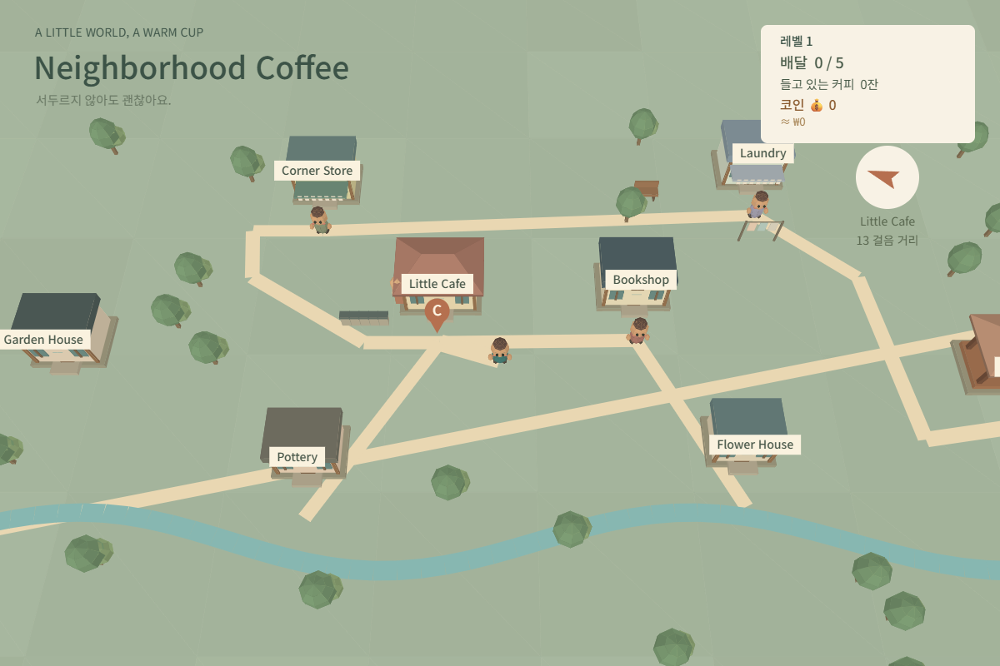
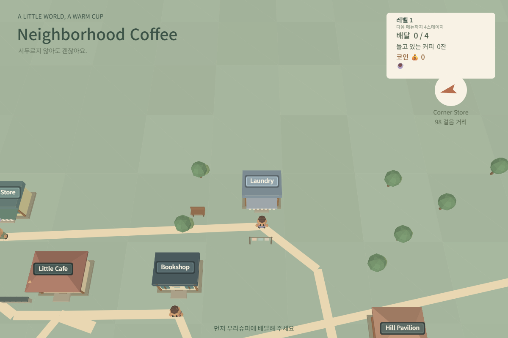

### 7-2. 咖啡店扩张(카페 확장)

- **목표**: 돈을 써서 카페를 키우면 외관도 실제로 커지는 느낌 주기.
- **A의 prompt 원문**: `装饰咖啡店可以提升咖啡价格`(#15), `...可以选择装饰地图或者扩大咖啡店...`(#19) — "扩大"(확장한다)라는 단어만 쓰고 무엇이 어떻게 커지는지는 적지 않음.
- **A의 결과**: "카페 확장"이 외관 변화 없이 "원두 품질" 수치(가격만 오름) 업그레이드로 구현됨(`WEEK5_LOG.md` 1절).
- **B의 prompt 핵심**: `B_PROMPTS.md` #16 (2026-10-01 03:32) — 0 / 1~3 / 4~6 / 7~9 / 10 레벨 5단계로 나누고, 단계마다 추가될 구체적 오브젝트(차양+화분 → 야외 테이블+칠판 → 좌측 확장+간판 확대 → 반짝이는 조명)를 명시. 가격·확률 등 "유지할 것"과 "진열대를 가리면 안 된다"는 제약도 포함.
- **B의 결과**: 5단계 외관이 각각 다르게 구현됨(`WEEK5_LOG.md` 3절 표 10번). 스크린샷 `cafe_quality_0/1/4/7/10.png`로 단계별 외관 확인. `A_cafe_quality10.png`(외관 변화 없음) vs `cafe_quality_10.png`(확장 완료 모습) 비교 가능.
- **차이와 원인**: A는 "扩大"라는 추상적 동사만 썼기 때문에 AI가 가장 쉬운 해석(수치 업그레이드)으로 처리했다. B는 "몇 단계로, 각 단계에 무엇이 생기는지"까지 구체화해 실제 외관 변화로 이어졌다.

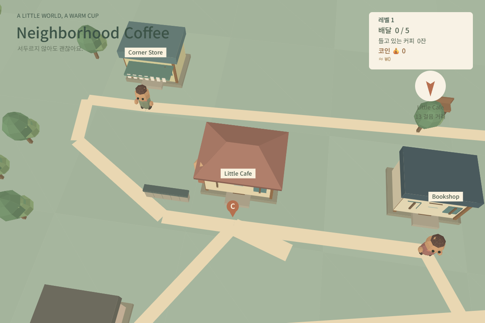
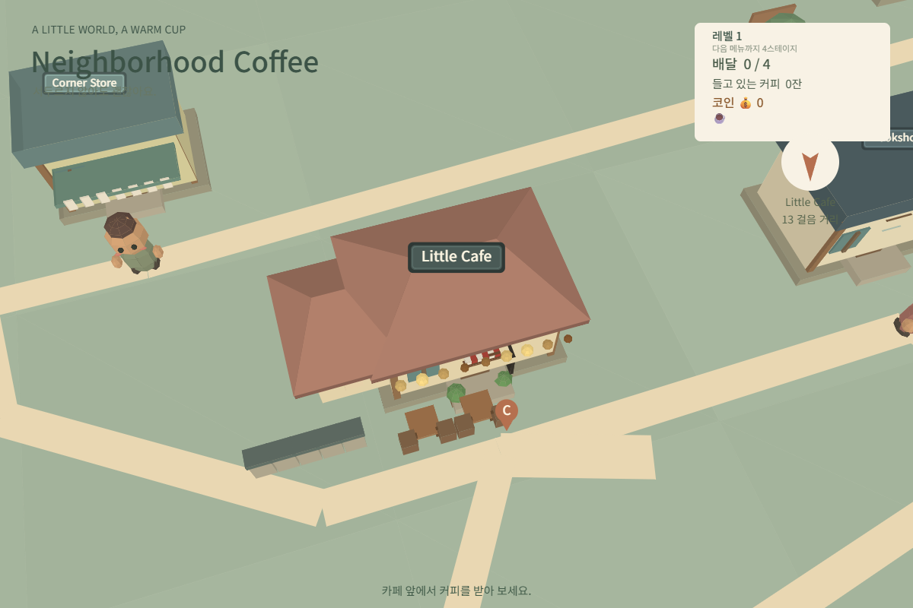

### 7-3. 트레이 "×숫자" 표시

- **목표**: 잔 수가 많을 때 트레이가 어색해 보이지 않게 하기.
- **A의 prompt / A의 결과**: 해당 없음 — A 대화에서는 다루지 않은 기능으로, B에서 새로 요청함.
- **B의 prompt 핵심(1차)**: `B_PROMPTS.md` #11 (2026-09-30 22:43) — 트레이 크기를 잔 수에 비례해 최대 2배까지 키우고, 트레이가 다 못 담는 수량이면 옆에 "×숫자"로 총 잔 수를 표시하도록 사용자가 직접 설계해서 지시.
- **B의 결과(1차)**: 지시대로 구현됐지만, 실제로 플레이해보니 "×숫자"가 인물 옆에 시스템 알림처럼 떠서 보기 불편함을 느낌.
- **B의 prompt 핵심(2차)**: `B_PROMPTS.md` #12 (2026-09-30 22:58) — "×숫자" 표시를 삭제하고, 트레이 크기를 잔 수만큼 그대로 보이게 하며 상한을 없애고, 배달 후에는 트레이 크기는 그대로 두고 잔만 줄어들게 재설계.
- **B의 결과(2차)**: 재설계대로 반영됨. 스크린샷 `B_tray_many.png`(최종 모습) vs `A_tray_many.png`(원래 트레이) 비교 가능.
- **차이와 원인**: 구조화 prompt를 썼어도, "어떻게 표시할지"의 구체적 방식(×숫자)을 AI가 아니라 사용자 자신이 정해서 지시했기 때문에, 막상 결과물을 보니 마음에 들지 않는 디자인이 나왔다. 구조화는 "요구사항 누락"은 막아주지만, "내가 생각한 아이디어 자체가 실제로 보면 별로일 수 있다"는 문제까지는 막지 못했고, 결국 실물을 본 뒤 다시 구조화 prompt로 고쳐야 했다.

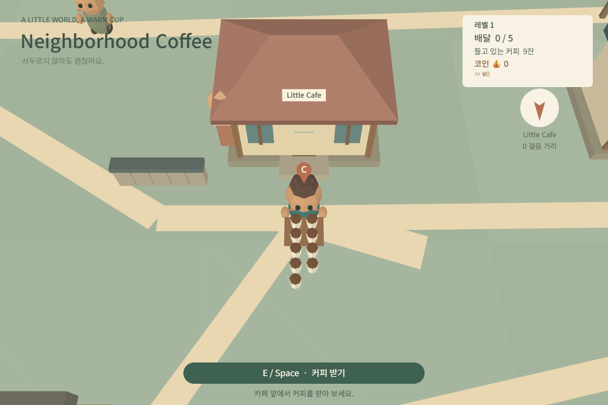
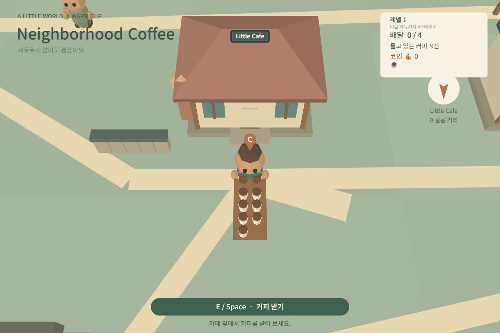

### 7-4. 문제가 생겼을 때 전달하는 방식

- **목표**: 버그를 고쳐 달라고 할 때 AI가 정확히 무엇이 문제인지 이해하게 하기.
- **A의 prompt 원문**: `失败的请、再次尝试`(실패한 요청, 다시 시도, #20) — 무엇이 실패했는지, 어떤 결과를 원하는지 설명이 없음. (`让我尝试一下`(#16)도 새 지시가 아니었는데 AI가 새 수정으로 오해해 사용자가 다시 정정해야 했던 유사 사례.)
- **A의 결과**: 어떤 부분이 왜 실패했는지 AI가 스스로 짚어내지 못했을 가능성이 높음(A 대화 원문에서 AI의 실제 대응은 확인 필요).
- **B의 prompt 핵심**: `B_PROMPTS.md` #4 (2026-09-30 16:19) — `[问题重现]`(시작 → 카페에서 커피 받기 → 임의 이웃에게 배달) / `[实际结果]`(말풍선은 나오지만 하트가 안 보임) / `[期望结果]`(하트가 말풍선과 함께 2~3초 나타났다 사라짐) / `[修改范围]`(하트만 수정, 나머지 기능 유지, 원인과 재확인 방법도 요청).
- **B의 결과**: `WEEK5_LOG.md` 5절 사례1 — 하트를 말풍선 배경보다 먼저 그려서 가려졌던 그리기 순서 버그를 정확히 찾아 수정하고, 원인도 설명받음.
- **차이와 원인**: A는 "실패했다"는 결과/감정만 전달해 AI가 무엇을 다시 해야 할지 추측해야 했고, 심지어 새 지시로 오해되기도 했다. B는 재현 절차·실제 결과·기대 결과·수정 범위를 매번 고정된 틀로 줘서 AI가 원인을 정확히 짚고 범위를 벗어나지 않고 고칠 수 있었다.

### 7-5. 결과를 확인하는 방식

- **목표**: 작업이 끝났는지, 무엇이 확인됐는지 알기.
- **A의 prompt 원문**: `给我打开看看`(열어서 보여줘, #11), `结束了吗?`(끝났어?, #22) — 매번 사용자가 직접 "확인해줘", "끝났냐"고 물어야 했음.
- **A의 결과**: AI가 스스로 완료 여부·확인 내용을 보고하지 않아 반복 질문이 필요했던 것으로 보임(A 대화에서 AI가 실제로 한 번도 자발적 보고를 하지 않았는지는 확인 필요).
- **B의 prompt 핵심**: 채팅창 prompt가 아니라 `B/CLAUDE.md`의 "산출물" 규칙 — `마지막에 [변경한 점 / 직접 확인한 것 / 미확인] 세 가지로 짧게 정리한다`는 system prompt 규칙.
- **B의 결과**: `B_PROMPTS.md`의 요청들(#3, #5, #8, #10 등)을 보면 사용자가 "확인해줘"라고 따로 요청하지 않아도 Claude Code가 매번 변경/확인/미확인 형식으로 자동 보고함(`WEEK5_LOG.md` 4절 표).
- **차이와 원인**: 이 차이는 채팅창 prompt의 구조가 아니라 system prompt(CLAUDE.md)의 유무에서 나온다. B는 보고 습관이 CLAUDE.md에 고정 규칙으로 박혀 있어 매번 묻지 않아도 자동 적용됐고, A는 그런 규칙이 없어 사용자가 매번 직접 요청해야 했다.

### 7-6. 새 메뉴 추가

- **목표**: 메뉴가 늘어나면 실제로 다른 물건을 배달하는 느낌 주기.
- **A의 prompt 원문**: `...之后每3个关卡还可以为自己的咖啡店增加曲奇，蛋糕等小吃或者绿茶和冰沙等新饮品...相应的改变之后咖啡价格，也就是赚的钱可以越来越多。`(#19) — 쿠키·케이크·녹차·스무디 같은 새 메뉴 추가와 그에 따른 가격 변화만 언급.
- **A의 결과**: 새 메뉴가 추가돼도 실제로는 가격만 오르고, 배달하는 물건은 여전히 커피뿐이었음(사용자 확인).
- **B의 prompt 핵심**: `B_PROMPTS.md` #21 (2026-10-01 05:11) — 이웃마다 "가장 좋아하는 것"을 메뉴 해금 시 랜덤 배정, 머리 위에 원하는 아이콘 표시, 카페에서 그 라운드에 필요한 품목을 자동으로 받게 하고, 커피만 들었을 때는 트레이·그 외에는 손수레로 운반 수단을 교체하도록 단계별로 명시.
- **B의 결과**: 손수레 교체 및 품목별 배달이 반영됨 — 스크린샷 `cargo_tray_coffee_only.png`(커피만, 트레이) vs `cargo_cart_with_dessert.png`(디저트 포함, 손수레)로 확인.
- **차이와 원인**: A는 "메뉴를 늘린다"는 목표만 말하고 그 메뉴가 배달 과정에서 어떻게 쓰이는지 지정하지 않아 AI가 가장 쉬운 해석(가격 변수 추가)만 구현했다. B는 "이웃이 무엇을 원하는지 → 어떻게 받는지 → 어떻게 보여주는지 → 운반 수단을 어떻게 바꾸는지"까지 단계별로 명시해 배달 로직 자체가 바뀌었다.

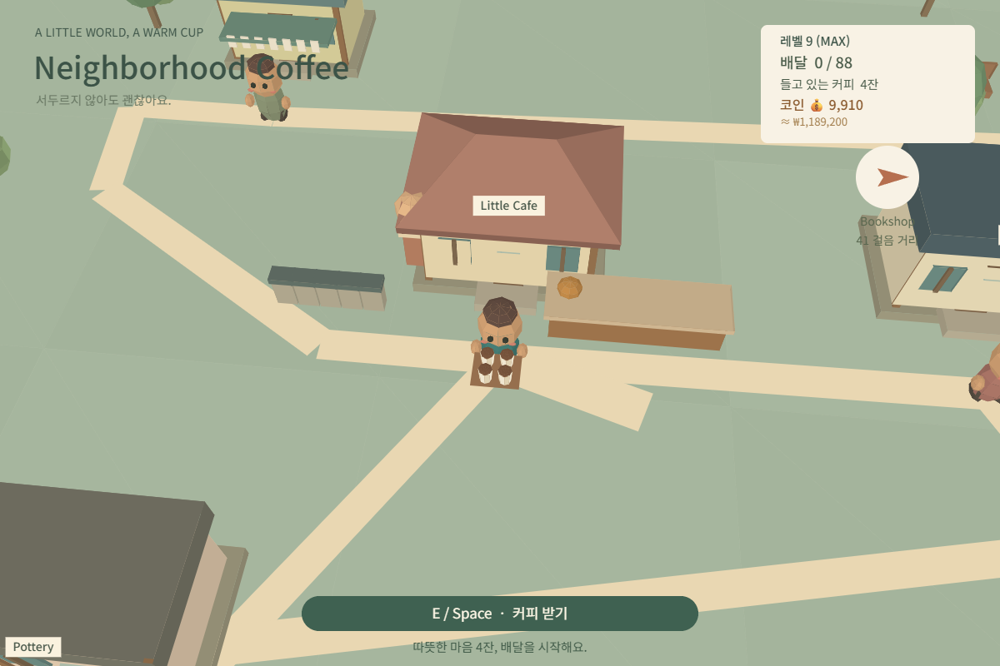
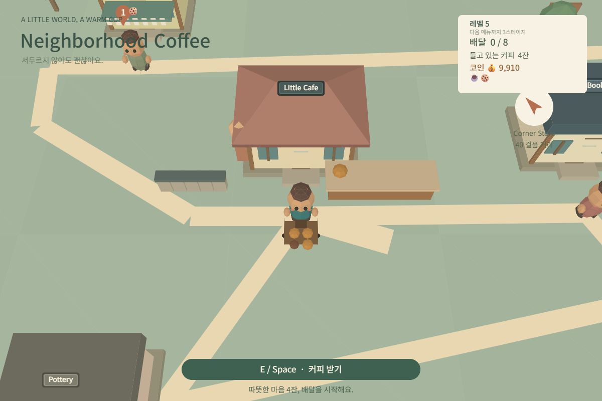

### 7-7. 충돌(통과 금지) 처리

- **목표**: 나무·건물·소품이 전부 예외 없이 사람을 막도록 하기.
- **A의 prompt / A의 결과**: 해당 없음 — A에서는 다루지 않은 기능으로, B에서 새로 추가함.
- **B의 prompt 핵심(1차)**: `B_PROMPTS.md` #18 (2026-10-01 04:08) — "모든 건물(기존 건물, 새 이웃 집, 카페 확장 부분)과 나무, 야외 가구·화분·진열대가 막혀야 한다"고 범위는 포괄적으로 썼지만, 개별 오브젝트 목록이나 전수 확인 방법은 지시하지 않음.
- **B의 결과(1차)**: 일부만 반영됨 — 재확인해보니(`B_PROMPTS.md` #19) 나무도 일부만 막히고, 처음부터 있던 오브젝트 중에도 통과되는 것이 남아 있었음.
- **B의 prompt 핵심(2차)**: `B_PROMPTS.md` #19 (2026-10-01 04:35) — "지도 위 모든 나무와 건물을 하나하나(종류별이 아니라 개체별) 목록으로 만들어 충돌 여부와 범위 일치 여부를 확인하고, 빠짐없이 전수 확인 후 수정", 결과를 표(오브젝트명/수정 전 문제/수정 후 정상 여부)로 보고하도록 명시.
- **B의 결과(2차)**: `WEEK5_LOG.md` 5절 사례2 — 건물 충돌을 부정확한 원에서 실제 가로·세로+처마를 반영한 사각형으로 교체, 나무 반지름 확대, 충돌이 아예 없던 9종 오브젝트(꽃밭·담장·벤치·대문·카페 원두통 장식 등)에 충돌 신규 추가, 전수 확인 표로 보고.
- **차이와 원인**: 1차 prompt는 "전부 막아 달라"는 목표는 명확했지만 "무엇을 기준으로 몇 개를 확인했는지" 검증 절차를 지시하지 않아 AI가 일부(카페 주변 위주)만 손대고 끝낸 것으로 보인다. 2차는 "개체별 전수 목록화 + 표로 보고"라는 검증 절차 자체를 prompt에 포함시켜 누락을 막았다.

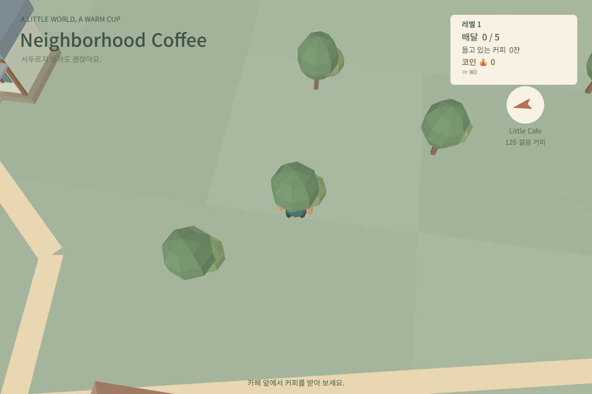
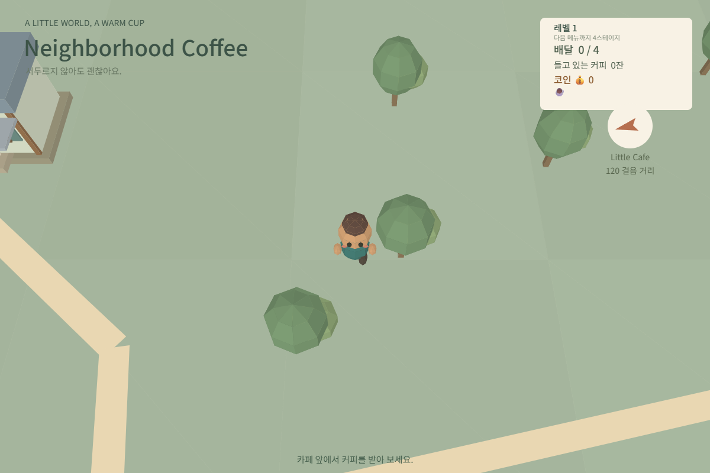

### 7-8. 건물 장식

- **목표**: 미화도를 올리면 건물마다 실제 장식이 보이게 하기.
- **A의 prompt / A의 결과**: 해당 없음 — B에서 새로 추가한 기능.
- **B의 prompt 핵심**: `B_PROMPTS.md` #20 (2026-10-01 04:59) — 미화도 4단계부터 건물별로 "무엇을 놓을지"(서점=책장, 마트=과일 상자, 세탁소=빨랫줄, 도자기 공방=도자기, 꽃벽집=화분)를 구체적으로 지정하고, 나머지 건물은 AI가 건물 특징에 맞게 정해서 알려 달라고 요청. 다만 장식이 "어떻게 생겼는지"(색, 모양, 크기, 화풍)는 지정하지 않음.
- **B의 결과**: 기능(건물마다 장식이 생김)은 완료 기준대로 구현됐지만, `WEEK5_LOG.md` 6절 회고에 "건물 장식의 외관 디자인이 충분히 예쁘지 않음(세부 디자인은 AI가 임의로 결정)"이라고 기록되어 있어 미적으로는 만족스럽지 않았음.
- **차이와 원인**: prompt에 "무엇을 놓을지"는 구체적으로 적었지만 "어떻게 생겼는지"는 적지 않아 AI가 디자인을 임의로 결정했다. 기능적 완료 기준은 달성했지만 미적 완성도까지는 보장되지 않았다 — 구조화 prompt도 "무엇을" 뿐 아니라 "어떻게 보이길 원하는지"까지 포함해야 한다는 교훈을 보여주는 사례다.

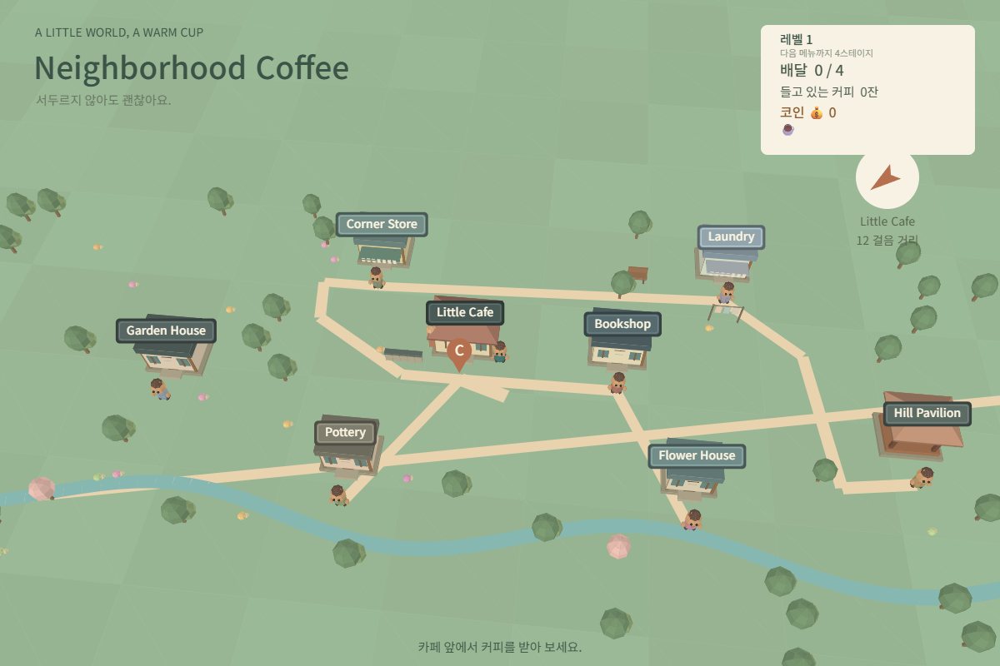
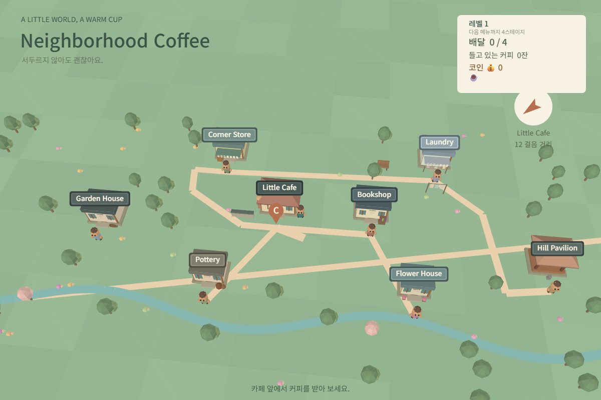
